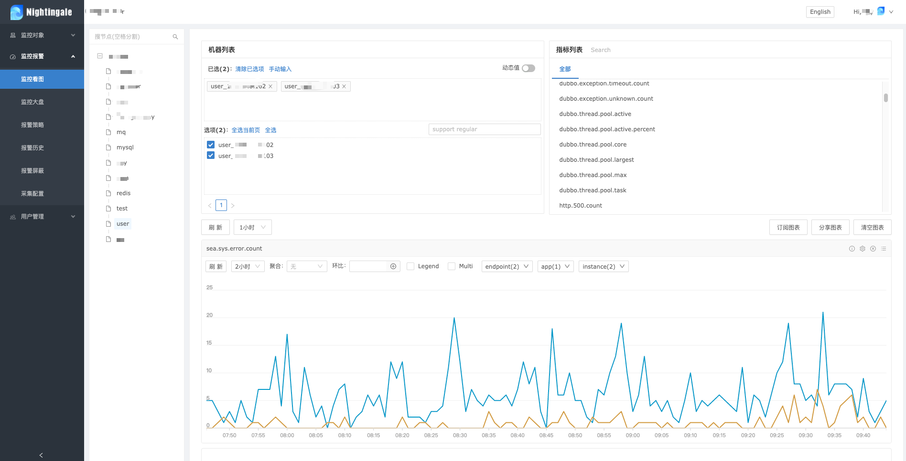
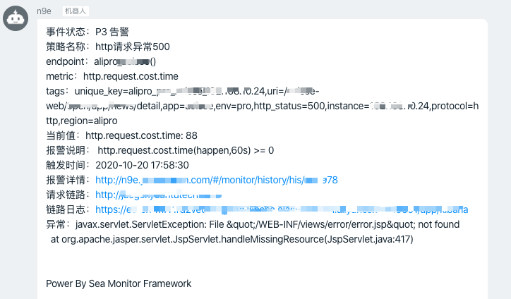
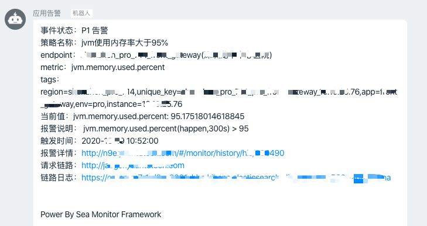
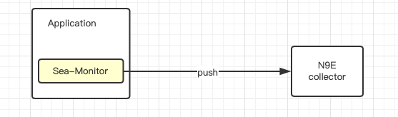
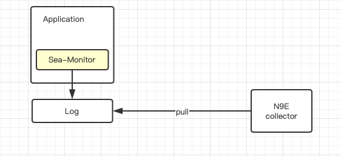

# sea-monitor

## Stargazers over time

[](https://starchart.cc/seaframework/sea-monitor-all)

> N9E java sdk，采集应用数据上报N9E。
> V3版本与V5版本架构差异，V3请选择1.3.1版本，V5版本请选择3.0.0-SNAPSHOT
> V5版本请选择定制化的https://github.com/taotao365s/nightingale，否则业务监控不起作用

## Overview

### 后端截图



### 报警截图




## 架构

> sea-monitor默认情况下以SDK形式嵌入到应用，方便研发人员使用；
>
> 支持PUSH和Pull两种模式，push模式是异步上报到N9E-collector，pull模式需要自己采集日志

### push方式（默认）



### Pull方式（支持）



## 工程结构

````
├── sea-monitor   // 监控SDK
├── sea-monitor-boot-starter // spring-boot工程集成
├── sea-monitor-boot-starter-demo  // spring-boot工程示例
└── sea-monitor-web-demo // 常规spring-web工程示例
````

## Doc

支持的中间件以及API

- [Sea-Monitor SDK API](doc/api.md)
- spring & spring-boot 等Java工程集成 [V3](doc/project.md) [V5](doc/project.v5.md)
- [直达异常链路](doc/trace.md)
- [系统（全局）级监控](doc/system.md)
- [JVM监控](doc/jvm.md)
- [Tomcat监控](doc/tomcat.md)
- [Dubbo监控](doc/dubbo.md)
- [DB连接池监控](doc/db.md)
- [Http异常监控](doc/http.md)
- [SQL监控](doc/mybatis.md)
- [Redis连接池监控](doc/redis.md)
- [线程池监控](doc/threadPool.md)
- [RocketMQ-Broker监控](doc/rocketmq.md)

## API

更多请参考[这里](doc/api.md)

### 单个指标

````  
      MetricDTO metricDTO = new MetricDTO();
      metricDTO.setMetric("http_request_error");
      metricDTO.setValue(1);
      metricDTO.setErrorFlag(true);
      metricDTO.setTraceIdFlag(true);
      SeaMonitor.logMetric(metricDTO);
````

### 统计指标

````
     SeaMonitor.logCount("http_count");
````

### SPI扩展指标

> 适用于定制化周期性指标上报，统计周期1min

- 在`META-INF/service/`目录下新建文件`com.github.seaframework.monitor.heartbeat.StatusExtension`
- `实现接口com.github.seaframework.monitor.heartbeat.StatusExtension`
- `META-INF/service/com.github.seaframework.monitor.heartbeat.StatusExtension`文件中存放对应的实现类即可

## 参考资料

- SDK的实现参考了CAT-SDK
- 感谢N9E团队的支持

## 最后

> 您的支持是我最大的动力

 

