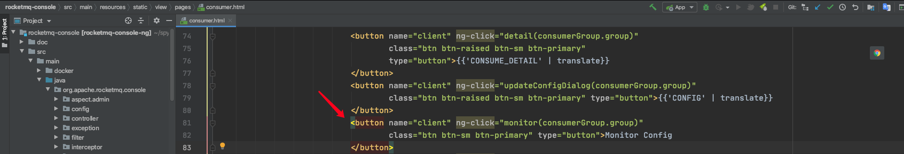

# RocketMQ-Broker监控

## 指标
|  指标名称   | 描述  |
|  ----  | ----  |
| mq.consumer.tps  | 消费者TPS |
| mq.consumer.count  | 消费者个数 |
| mq.consumer.min.count.delta  | 消费者最小值变化量，可以以此为监控项 |
| mq.consumer.diff.total  | 消费堆积数 |
| mq.consumer.diff.total.delta  | 消费堆积变化量，可以以此为监控项 |


## rocketmq-console定制

### 前端


取消注释

### 后端

`src/main/java/org/apache/rocketmq/console/task/MonitorTask.java`

````
@Component
public class MonitorTask {
    private Logger logger = LoggerFactory.getLogger(MonitorTask.class);

    @Resource
    private MonitorService monitorService;

    @Resource
    private ConsumerService consumerService;

    @Scheduled(cron = "0/20 * * * * ?")
    public void scanProblemConsumeGroup() {

        logger.info("scan consumer info.");

        List<MonitorInfoDTO> data = new ArrayList<>();
        for (Map.Entry<String, ConsumerMonitorConfig> configEntry : monitorService.queryConsumerMonitorConfig().entrySet()) {
            GroupConsumeInfo consumeInfo = consumerService.queryGroup(configEntry.getKey());

            Map<String, String> tagMap = new HashMap<>();
            tagMap.put(TagConst.SERVICE, configEntry.getKey());

            Map<String, Number> map = new HashMap<>();

            map.put("mq.consumer.tps", consumeInfo.getConsumeTps());
            map.put("mq.consumer.count", consumeInfo.getCount());
            map.put("mq.consumer.min.count.delta", consumeInfo.getCount() - configEntry.getValue().getMinCount());
            map.put("mq.consumer.diff.total", consumeInfo.getDiffTotal());
            map.put("mq.consumer.diff.total.delta", consumeInfo.getDiffTotal() - configEntry.getValue().getMaxDiffTotal());


            MonitorInfoDTO monitorInfoDTO = new MonitorInfoDTO();
            monitorInfoDTO.setMetricMap(map);
            monitorInfoDTO.setTagMap(tagMap);
            data.add(monitorInfoDTO);
        }
        send(data);
    }

    private void send(List<MonitorInfoDTO> data) {
        if (ListUtil.isEmpty(data)) {
            return;
        }

        data.stream()
            .parallel()
            .forEach(infoDTO -> {

                infoDTO.getMetricMap().entrySet().stream().forEach(item -> {
                    MetricDTO metricDTO = new MetricDTO();
                    metricDTO.setMetric(item.getKey());
                    metricDTO.setValue(Double.valueOf(item.getValue().toString()));

                    Map<String, String> tagsMap = new HashMap<>();
                    tagsMap.put(TagConst.SERVICE, infoDTO.getTagMap().get(TagConst.SERVICE));
                    metricDTO.setTagsMap(tagsMap);
                    metricDTO.setStep(20);
                    SeaMonitor.logMetric(metricDTO);
                });
            });
    }

    @Data
    private class MonitorInfoDTO {
        private Map<String, Number> metricMap;
        private Map<String, String> tagMap;
    }


}
````

## 构建&启动

````
nohup java -jar rocketmq-console-ng-1.0.1.jar \
--rocketmq.config.namesrvAddr=172.17.8.101:9876 \
--sea.monitor.enabled=true \
--sea.monitor.uri=http://127.0.0.1:2058/api/collector/push & 
````