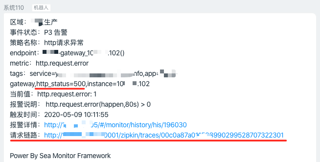

# 直达异常链路

## 效果


## 原理

在每次请求过程中，系统会产生traceId（可参考集成sofa-tracer），将traceId写入 N9E API的`extra`字段中, dingtalk-sender解析traceId即可。

## 示例

- 这里已sofa-tracer集成为例
- `src/main/resources/META-INF/services/com.github.seaframework.monitor.trace.TraceExtension`中配置自定义的traceId实现（sofa-trace已内置）

````
@LoadLevel(name = "default") // 注意这里name，最终配置再sea.monitor.trace中
public class DefaultTraceExtension implements TraceExtension {

    @Override
    public String getTraceId() {
        try {
            SofaTracerSpanContext spanContext = SofaTraceContextHolder.getSofaTraceContext()
                                                                      .getCurrentSpan()
                                                                      .getSofaTracerSpanContext();
            return spanContext.getTraceId();
        } catch (Exception e) {
            log.error("fail to get span_id");
        }

        return "";
    }
}
````
- `sea.monitor.properties`文件配置`sea.monitor.trace=default`
- API使用

````
MetricDTO metricDTO = new MetricDTO();
....
metricDTO.setTraceIdFlag(true); //重点
....
````